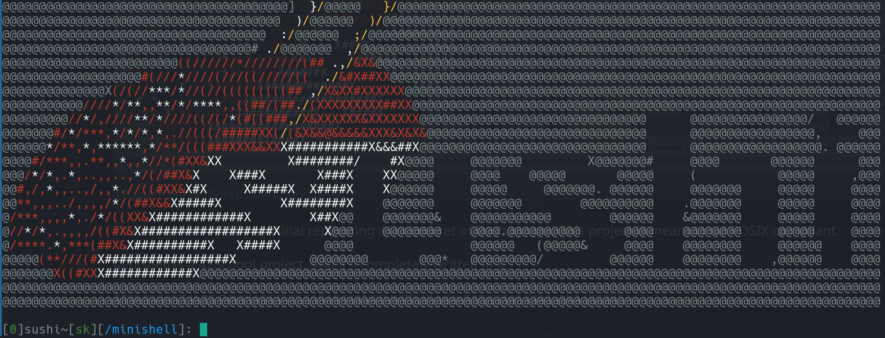

This is Sushi, a POSIX terminal replicating a limited set of Bash syntax. This project is meant to be POSIX compliant.

Minishell is a 42School project, and it's completely written in C.

This project makes use of the GNU readline. No changes has been performed to it
at the time being.

INSTRUCTIONS
- before Making, run the configure script inside readline directory. After the
	readline conigure script has done it's job, sushi can be compiled through
	it's Makefile.
- if system complains about -lreadline not being found, install readline from your system repository. This project compiles and includes source for readline,
  but at linking time that flag is needed and will search system library directories for required headers.

This project was developed in collaboration with (Kevin Krzysztof Zak), aka (kzak).

